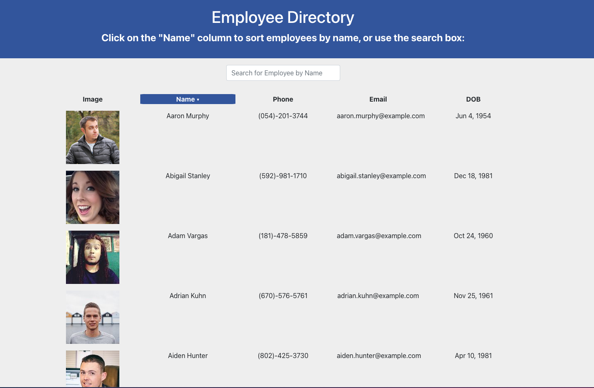
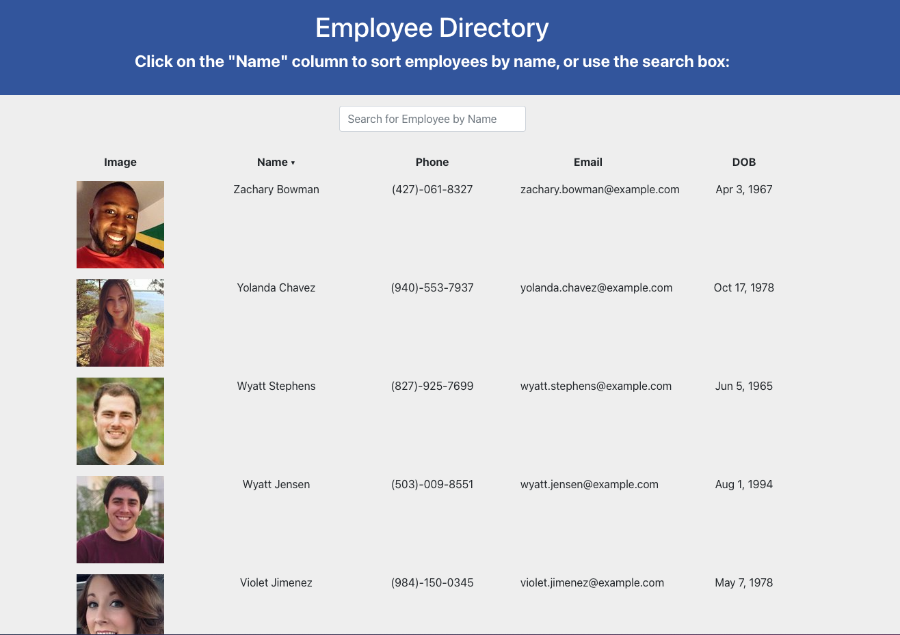
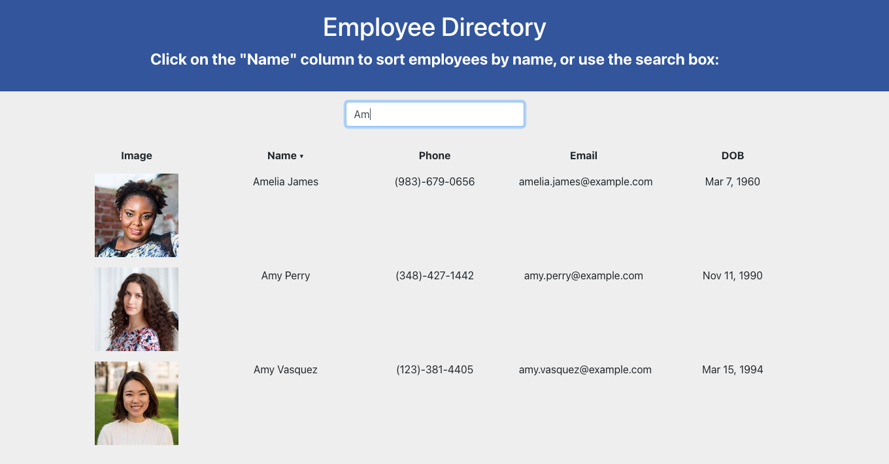

# Employee Directory React/Node Web App
  [](https://opensource.org/licenses/MIT)

  ## Description

  This front-end React JS web application is a quick-access searchable and sortable Employee Directory. Employees and managers benefit greatly by being able to view non-sensitive data about other employees, especially when they can filter by categories and search by name. This React web app allows users to sort employees by name, and to search for specific employess by name. It uses React components to manage state and respond to user events.  


  ## Table of Contents

  * [Installation](#installation)
  * [Usage](#usage)
  * [Screenshots](#screenshots)
  * [License](#license)
  * [Contribute](#contribute)
  * [Tests](#tests)
  * [Questions](#questions)
 
  ## Installation

  This app is deployed live on GitHub Pages, and you can find it live here:

  [Live Deployed Application](https://srfujii.github.io/EmployeeDirectoryReactApp/)
  

  To install locally, do the following: 
  
  To install necessary dependencies, run the following command:

  ```
  npm i
  ```

  To start the application, run:

  ```
  npm start
  ```

  This project was bootstrapped with [Create React App](https://github.com/facebook/create-react-app).


  ## Usage

  This is a student repo.


  ## Screenshots

  
  
  


  ## License

  [](https://opensource.org/licenses/MIT) This project is licensed under the [MIT](https://opensource.org/licenses/MIT) license.


  ## Contribute

  Contributions are always welcome! (Please fork and pull request only.)


  ## Tests

  To run tests, run the following command: 

  ```
  npm test
  ```

  ## Questions

  If you have any questions about the repo, open an issue or contact me directly at susan.fujii@me.com. You can find more of my work at [srfujii](https://github.com/srfujii/).

